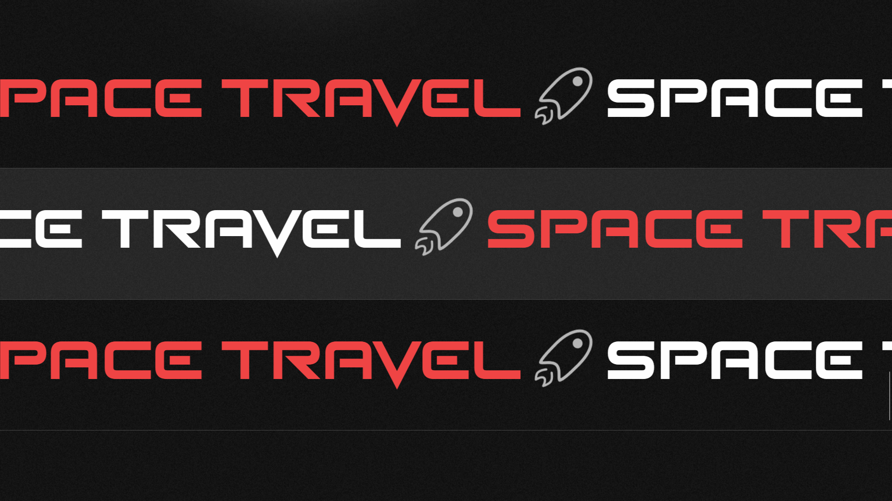
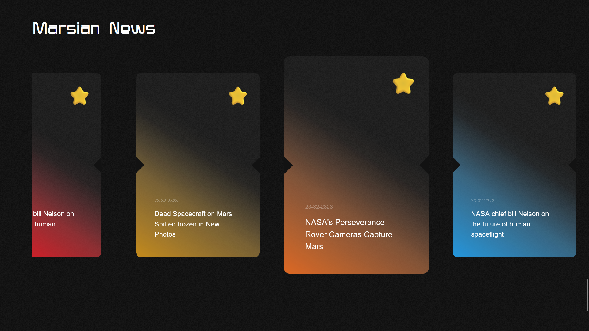

<div align="center">

# Mars Travels  🚀👩‍🚀


</div>

## 👩‍🚀 What is this ?

This is a simple UI design of a Mars Travels website. This is a simple project to show the use of Three.js in React.

## Technologies used:
- React
- Scss 
- Three.js
- Tailwind CSS
- React Three Fiber

## 🚀 How to run this project ?

1. Clone the repository.
2. Run `yarn install` to install the dependencies.
3. Run `yarn dev` to start the development server.

```
    
    git clone https://github.com/SouZe-San/project-Mars.git
    cd project-Mars

    yarn install
    yarn dev
```

## One Glance 🎥


##  Some Shots 📸 !!





